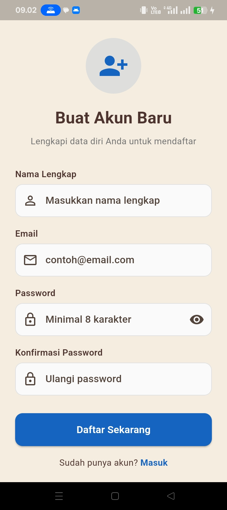
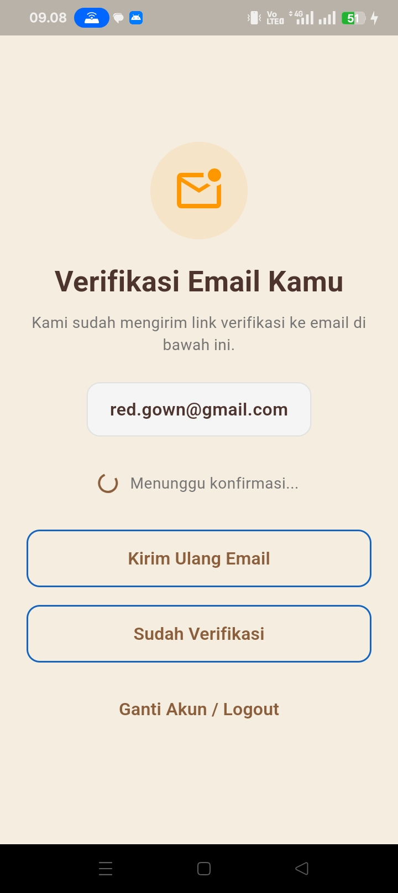
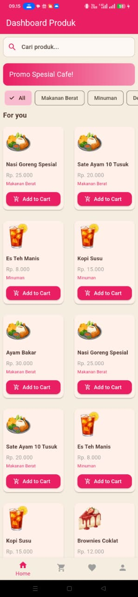
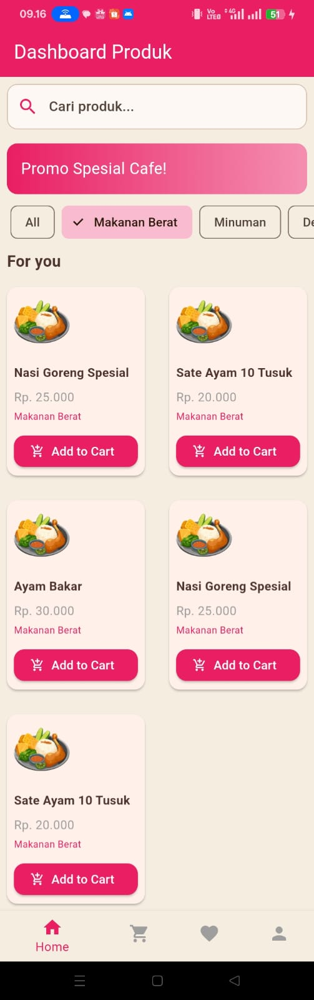
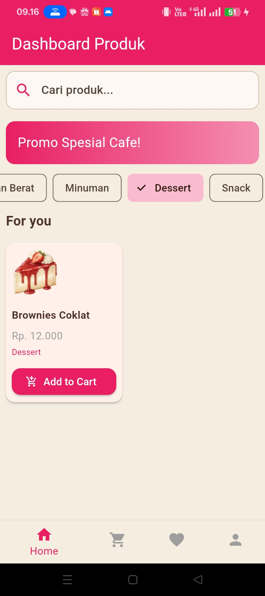
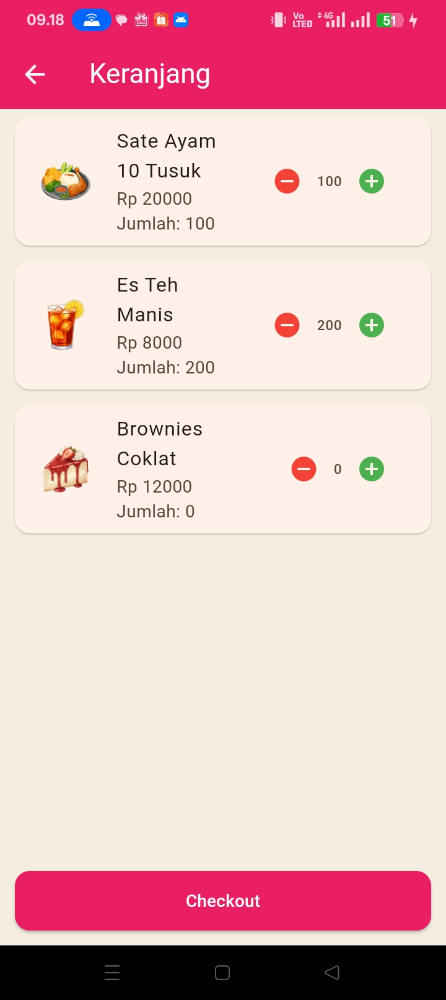
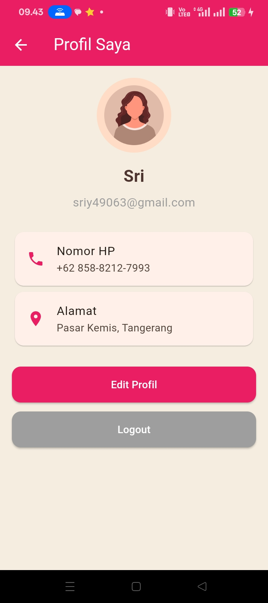
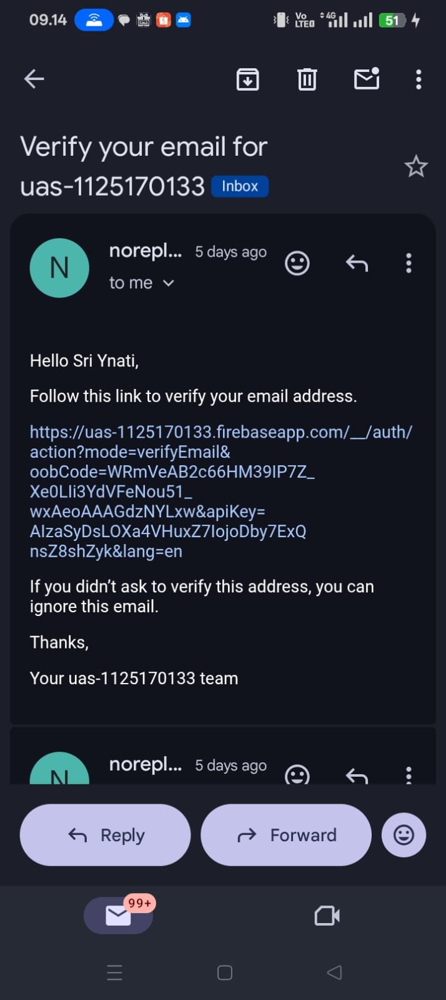

# 🍰 Shopping Tangerang App

Aplikasi UAS Mobile Lanjutan — Flutter project untuk katalog produk dan pemesanan online.

## 📱 Tampilan Aplikasi

### 🔐 Login

Halaman login pengguna dengan form email dan password.

### 📝 Register

Halaman pendaftaran akun baru dengan input data pengguna.

### ✉️ Verifikasi Email

Menampilkan proses verifikasi email setelah registrasi.

### 🏠 Dashboard

Menampilkan daftar produk dan kategori utama.

### 🍛 Kategori Makanan Berat

Menampilkan daftar menu makanan berat seperti nasi, ayam, dan lauk lainnya.

### 🍰 Kategori Dessert

Menampilkan daftar menu dessert yang tersedia di katalog.

### 🍹 Kategori Minuman

Menampilkan daftar menu minuman dengan gambar dan harga.

### 🛒 Cart

Menampilkan produk yang sudah ditambahkan ke keranjang dan tombol checkout.

### 👤 Profile

Menampilkan informasi pengguna dan pengaturan akun.

### 💬 Email

Menampilkan tampilan pengiriman email atau notifikasi dari sistem.

---

## 💡 Fitur Utama
- Menampilkan daftar produk dari database MySQL via API Go.
- Filter kategori: Makanan Berat, Minuman, Dessert, Snack.
- Keranjang belanja dengan total harga otomatis.
- Navigasi antar halaman menggunakan BottomNavigationBar.

---

## ⚙️ Teknologi
- **Frontend:** Flutter  
- **Backend:** Go (Gin, GORM, MySQL)  
- **Database:** MySQL  
- **Version Control:** Git & GitHub  

---

## 🧠 Tentang Proyek
Dikembangkan untuk UAS Mobile Lanjutan oleh **Sriyanti (1125170133)**.  
Tujuan proyek ini adalah mengintegrasikan Flutter dengan backend Go untuk sistem katalog produk.
